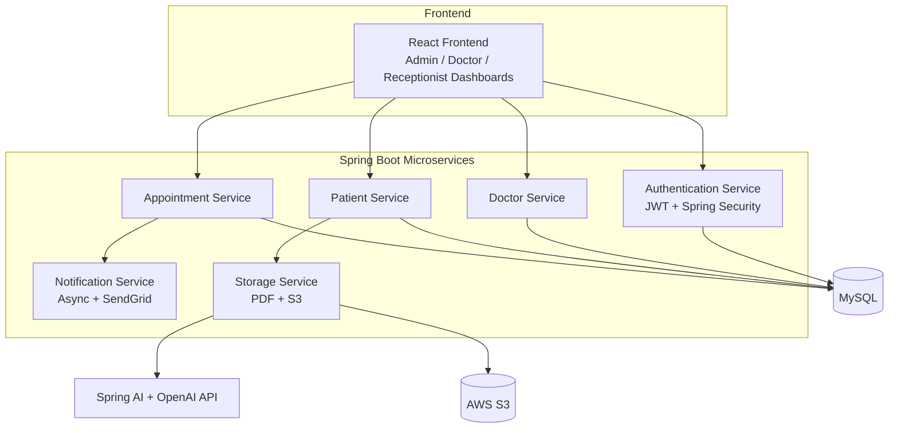

# MediSphere — AI-Powered Hospital Management System

*A smart, AI-integrated backend platform for streamlining hospital operations*


---

## 1. Project Overview

MedSync is a full-stack hospital management system built on a **Spring Boot microservices architecture**, designed to digitize and streamline core hospital operations — doctor and patient management, appointment scheduling, bed/staff allocation, notifications, and discharge documentation.

The system is composed of **six independently deployable microservices** (Authentication, Doctor, Patient, Appointment, Notification, Storage), each owning a distinct responsibility, communicating to support role-specific dashboards for **Admin**, **Doctor**, and **Receptionist** users on the frontend.

Beyond standard CRUD-based hospital workflows, MedSync integrates **Spring AI with the OpenAI API** to generate context-aware dietary and prescription suggestions at discharge time — reducing manual documentation effort while keeping a human (the doctor) in the final decision loop.

---

## 2. Problem Statement

Hospitals frequently rely on manual, paper-based, or fragmented digital processes to manage:

- Doctor registration, scheduling, and patient history access
- Patient registration, appointment booking, and medical record tracking
- Staff and bed/room allocation
- Discharge documentation, including diagnosis and prescription summaries
- Timely communication with patients (confirmations, reminders) and doctors (daily schedules)

These manual processes are slow, error-prone, and don't scale well as patient volume grows. There is also little automated support for **synthesizing diagnosis and prescription data into structured, patient-friendly discharge summaries** — this step is typically done manually by administrative or clinical staff.

## 3. Solution Overview

MedSync addresses this by providing:

- A **microservices backend** where each hospital function (auth, doctors, patients, appointments, notifications, storage) is a separately deployable service, enabling independent scaling and clearer ownership boundaries.
- **Role-based dashboards** (Admin / Doctor / Receptionist) so each user only sees and can act on what's relevant to their role.
- **AI-assisted discharge summaries**, where structured diagnosis and prescription data captured during a patient's visit is passed to an LLM (via Spring AI + OpenAI) to generate dietary and care recommendations, which are then rendered into a downloadable PDF.
- **Automated, asynchronous notifications** for appointment confirmations, reminders, and daily doctor schedules — decoupled from the main request path so they don't block core API responses.
- **Secure, cloud-based document storage** for discharge summaries via AWS S3 with pre-signed URLs, rather than storing sensitive PDFs on the application server.

---

## 4. Key Features

### Doctor Management
- Admins can register, update, and manage doctor profiles
- Doctors can log in, view their schedules, and access patient details
- AI-assisted diagnosis/prescription support at the point of discharge

### Patient Management
- Receptionists register new patients
- Doctors view patient history and update diagnoses
- Patients receive appointment confirmations via email

### Appointment Management
- Receptionists schedule, update, and cancel appointments
- Doctors view their booked appointments
- Patients receive automated appointment reminders

### Staff & Hospital Resource Management
- Manage hospital staff details (receptionists, nurses, etc.)
- Allocate and track hospital beds and rooms

### Notifications
- Asynchronous email notifications for bookings and updates (SendGrid)
- Daily appointment schedules emailed to doctors

### Discharge Summary Generation & Storage
- Receptionists generate discharge summaries as PDFs
- AI-extracted diagnosis and prescription data is injected into the summary at render time
- PDFs are uploaded to AWS S3 and made available via secure, pre-signed download links

---

## 5. AI/ML Capabilities

### What AI problem is being solved

At discharge, clinical staff need to translate a patient's diagnosis and prescription data into a clear, actionable summary — including dietary guidance appropriate to the patient's condition. Manually drafting this every time is repetitive and time-consuming. MedSync uses AI to **draft** this content from structured inputs, so staff review and finalize it rather than writing it from scratch.

### Why AI is needed

Diet and care recommendations depend on combining multiple structured fields (diagnosis, prescriptions, patient context) into coherent, readable guidance — a natural-language generation task that a rules engine would need to hand-encode diagnosis by diagnosis. An LLM generalizes across many diagnosis/prescription combinations without that manual encoding.

### AI/ML technique used

- **Spring AI** as the integration layer between the application and the model provider
- **OpenAI API** (via Spring AI's chat client abstraction) as the underlying LLM
- This is a **prompt-based generation** approach (structured input → LLM → generated text), not a custom-trained or fine-tuned model

### How data flows through the AI component

```mermaid
flowchart LR
    A[Doctor finalizes<br/>diagnosis & prescription] --> B[Patient Service<br/>persists structured data]
    B --> C[Discharge workflow<br/>triggered by Receptionist]
    C --> D[Spring AI Client]
    D --> E[OpenAI API]
    E --> F[Generated diet &<br/>care recommendations]
    F --> G[Thymeleaf template<br/>+ FlyingSaucer PDF render]
    G --> H[AWS S3 upload]
    H --> I[Pre-signed URL<br/>returned to Receptionist]
```



1. A doctor records diagnosis and prescription details for a patient, persisted by the Patient service.
2. At discharge, this structured data is passed to a Spring AI-backed service, which constructs a prompt and calls the OpenAI API.
3. The model returns generated dietary/care suggestions as text.
4. This text, along with the original diagnosis and prescription data, is injected into a Thymeleaf HTML template.
5. FlyingSaucer renders the populated template into a PDF.
6. The PDF is uploaded to AWS S3, and a pre-signed URL is returned for secure download.

### Output of the AI component

Structured, human-readable dietary and prescription-related recommendations that are embedded directly into the discharge summary PDF — reviewed by staff before being shared with the patient.

> **Note:** The AI output is treated as a drafting aid, not an autonomous clinical decision — human review remains part of the workflow.

---

## 6. System Architecture

MedSync follows a **microservices design**, with each service owning its own responsibility and, where applicable, its own data:

| Service | Responsibility |
|---|---|
| **Authentication Service** | User login, JWT issuance/validation, Spring Security integration |
| **Doctor Service** | Doctor profiles, schedules |
| **Patient Service** | Patient records, diagnosis & medical history |
| **Appointment Service** | Booking, updates, cancellations |
| **Notification Service** | Asynchronous email notifications (confirmations, reminders, daily schedules) |
| **Storage Service** | PDF generation and AWS S3 uploads |



### User Roles & Access Control

| Role | Permissions |
|---|---|
| **Admin** | Manages doctors, staff, and system settings |
| **Receptionist** | Registers patients, books appointments, manages beds, generates discharge summaries |
| **Doctor** | Views appointments, updates diagnosis, prescribes medication |

---

## 7. End-to-End Project Workflow

1. **Admin** registers doctors and configures staff/hospital resources.
2. **Receptionist** registers a new patient and books an appointment; the patient receives an email confirmation.
3. **Doctor** logs in, views their schedule, and accesses the patient's history during the visit.
4. **Doctor** records diagnosis and prescription details.
5. At discharge, **Receptionist** triggers discharge summary generation.
6. The **AI component** (Spring AI + OpenAI) generates diet/care recommendations from the structured diagnosis and prescription data.
7. The summary is rendered as a PDF (Thymeleaf + FlyingSaucer) and uploaded to **AWS S3**.
8. A secure, pre-signed download link is returned for retrieval.
9. Throughout, **notification workflows** run asynchronously to send confirmations and reminders without blocking core API requests.

---

## 8. Technology Stack

| Layer | Technology |
|---|---|
| **Backend** | Java, Spring Boot, Spring Security, Spring Data JPA / Hibernate, Microservices |
| **Frontend** | React |
| **Database** | MySQL |
| **Cloud Storage** | AWS S3 (pre-signed URLs) |
| **Authentication** | JWT, Spring Security |
| **Email Notifications** | SendGrid API, Spring `@Async` |
| **AI Integration** | Spring AI, OpenAI API |
| **PDF Generation** | Thymeleaf, FlyingSaucer |
| **Testing** | JUnit 5, Mockito, JMeter (load testing) |
| **Logging** | SLF4J / Logback with request-correlation IDs |

---

## 9. Backend Details

- **Microservices**: Six independently deployable services communicating to serve role-specific frontend dashboards.
- **Data access**: Hibernate/JPA with fetch-type tuning, HQL named queries, and composite indexing on high-read tables (appointments, patient records).
- **Transactional integrity**: `@Transactional` boundaries around multi-step operations; normalized MySQL schemas with foreign key constraints.
- **Caching**: Hibernate second-level caching applied to relatively static reference data (specializations, bed types) to reduce repetitive reads on high-frequency paths such as appointment slot availability checks.
- **Async processing**: Notification dispatch decoupled from request threads using Spring's `@Async`, improving appointment booking API throughput.
- **Error handling**: Centralized exception handling via `@ControllerAdvice` with custom error response DTOs.
- **Observability**: Structured logging (SLF4J/Logback) with request-correlation IDs to support tracing across services.

## Frontend Details

- React-based single-page application
- Role-specific dashboards for Admin, Doctor, and Receptionist, each surfacing only the relevant actions and data for that role

## Database

- MySQL with normalized schemas and foreign key constraints across doctors, patients, appointments, and staff/bed resources

---

## 10. APIs & Integrations

- **OpenAI API** (via Spring AI) — generation of dietary/care recommendations at discharge
- **AWS S3** — secure storage of generated discharge summary PDFs, accessed via pre-signed URLs
- **SendGrid API** — transactional email delivery for confirmations, reminders, and daily schedules

---

## 11. Project Structure

> The structure below reflects a typical multi-module Spring Boot microservices layout. Adjust to match your actual repository if it differs.

```
medsync/
├── auth-service/
├── doctor-service/
├── patient-service/
├── appointment-service/
├── notification-service/
├── storage-service/
├── frontend/                 # React application
├── docs/
│   └── MedSyncProblemStatement.pdf
└── README.md
```

---

## 12. Installation & Setup

### Prerequisites

- Java 17+ (or your project's target JDK)
- Maven or Gradle
- MySQL instance
- Node.js & npm (for the React frontend)
- AWS account with an S3 bucket
- SendGrid API key
- OpenAI API key


### Backend setup (per service)

```bash
cd doctor-service
mvn clean install
mvn spring-boot:run
```

Repeat for each microservice (`auth-service`, `patient-service`, `appointment-service`, `notification-service`, `storage-service`).

### Frontend setup

```bash
cd frontend
npm install
npm start
```

---

## 13. Environment Variables / Configuration

Each service reads its own configuration; typical values include:

```properties
# Database
spring.datasource.url=jdbc:mysql://localhost:3306/medsync
spring.datasource.username=${DB_USERNAME}
spring.datasource.password=${DB_PASSWORD}

# JWT
jwt.secret=${JWT_SECRET}
jwt.expiration=${JWT_EXPIRATION}

# AWS S3
aws.s3.bucket=${AWS_S3_BUCKET}
aws.access.key=${AWS_ACCESS_KEY}
aws.secret.key=${AWS_SECRET_KEY}

# SendGrid
sendgrid.api.key=${SENDGRID_API_KEY}

# Spring AI / OpenAI
spring.ai.openai.api-key=${OPENAI_API_KEY}
```

---

## 14. How to Run the Project

1. Start MySQL and create the required database(s).
2. Set required environment variables (DB, JWT, AWS, SendGrid, OpenAI).
3. Start each backend microservice individually.
4. Start the React frontend.
5. Access the application via the frontend URL (e.g., `http://localhost:3000`) and log in with a seeded Admin account.

---


## 15. Challenges Solved

- **Cross-service data consistency**: Coordinating patient, doctor, and appointment data across independently deployed services while maintaining transactional integrity within each service boundary.
- **Read-heavy performance under load**: Query and caching optimizations on high-traffic paths (e.g., appointment slot availability) to reduce redundant database hits.
- **Blocking notification delivery**: Moving email dispatch off the main request thread so notification latency doesn't affect core API response times.
- **Turning unstructured clinical judgment into structured summaries**: Using AI to bridge structured diagnosis/prescription data and natural-language discharge guidance, without removing human review from the process.
- **Secure document access**: Avoiding direct public exposure of sensitive discharge PDFs by using time-limited, pre-signed S3 URLs.

---

## 16. Future Enhancements

- Expand AI-assisted diagnosis support beyond discharge-time diet suggestions, as referenced in the original problem statement
- Add automated integration tests across service boundaries
- Introduce API gateway and service discovery for the microservices layer
- Add observability dashboards (metrics/tracing visualization) on top of the existing correlation-ID logging
- Role-based analytics for hospital administrators (occupancy, appointment trends)

---

## 17. Conclusion

MedSync demonstrates how a traditional hospital management workflow — doctor, patient, appointment, and resource management — can be modernized with a microservices architecture, asynchronous processing, and targeted AI assistance. The AI component is scoped deliberately: it drafts discharge-related recommendations from structured clinical data, while final review and decisions remain with hospital staff. Combined with performance-tuned data access and secure cloud storage, MedSync serves as a practical, scalable foundation for digital hospital operations.

---

*Built with Spring Boot, React, MySQL, AWS S3, and Spring AI (OpenAI).*
